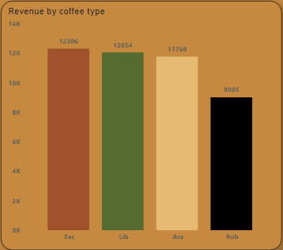
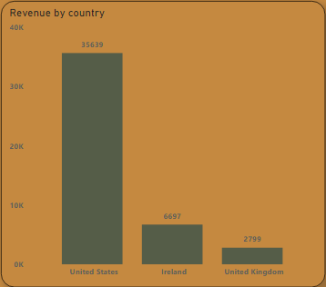
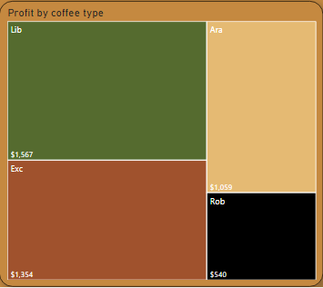
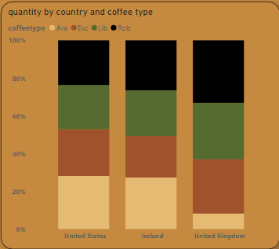
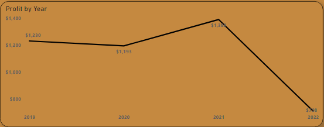
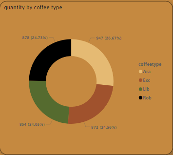
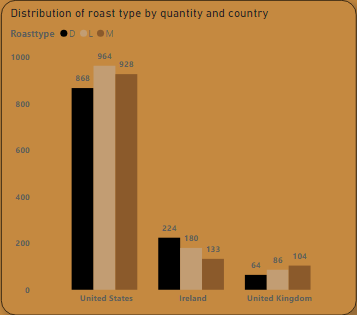
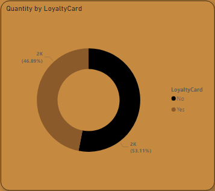

# Coffee-Beans-Analysis

### Project Overview
This project aims to analyze coffee sales data to uncover insights into revenue, profit margins, and customer preferences across different regions and coffee types. By examining trends and patterns, the project seeks to provide actionable recommendations for optimizing sales strategies and improving overall business performance.

### Data sources
This data was obtained from kaggle. You can find it [here.](https://www.kaggle.com/datasets/saadharoon27/coffee-bean-sales-raw-dataset)

### Tools
- SQL: Data cleaning and Data analysis
- Power BI: Visualization

### Data cleaning/preparation
1. Data Loading - Created a database and also created three tables. Loaded data into the tables.
2. Dropped usless columns.
3. Duplicate check - Checked for duplicates and confirmed there are no duplicate records.
4. Data type conversion - Updated date format to ensure proper analysis.
5. Created profits column - Calculated profit using formula Profit per unit*quantity. 

### Variable Engineering

### Exploratory Data Analysis
#### Revenue
- What is the total revenue?
- What is the distribution of revenue by coffee type?
- In Which countries are the revenues highest and lowest?
- What is the trend of revenue along the years?

#### Profit
- What is the total profit?
- Express the profit as a percentage of Total Revenue.
- What is the distribution of profit by coffee type?
- What is th distribution of profit by years?

#### Customer preferences
- what coffee types are most and least preferred countrywise?
- what coffee type is generally preffered?
- What roast type is mostly preferred countrywise?

## Loyalty program
- How many customers have the loyalty cards?
- What is the distribution of quantity by loyaltycards?

### Code
```SQL
CREATE DATABASE coffeebeans;

CREATE TABLE coffeecustomers;
CREATE TABLE coffeeprods;
CREATE TABLE orders;

-- --Data cleaning
-- --DROPPING USELESS COLUMNS

ALTER TABLE orders
DROP Customer_Name,
DROP Email,
DROP Country,
DROP Coffeetype,
DROP Roasttype,
DROP Size,
DROP Unitprice,
DROP Sales;

-- --CHECKING FOR DUPLICATES
WITH duplicates as(
SELECT *,
ROW_NUMBER() OVER(PARTITION BY OrderID, OrderDate, CustomerID, ProductID, Quantity) AS row_num
FROM orders
)
SELECT * 
FROM duplicates
WHERE row_num > 1;
```
### Findings
- The total revenue for the four years was $45.13K.
- Excelsa coffee yielded the highest revenue at $12,306 closeley followed by Liberica at $12,054. Arabica and Robusta yielded $11,768 and $9,005 respectively.

   
- USA had the highest revenue at $35,639 while UK had the lowest revenue at $2,799.

  
- Total profit stood at $4.52K.
- Liberica coffee yielded the largest profit at $1,576 while Robusta yielded the lowest proit at $540. Excelsa and Arabica yielded $1,353 and $1,059 respectively.

  
- In USA, Arabica is the most preferred coffee type and Liberica the least preffered. In UK, customers mostly prefer Robusta and they least prefer Arabica. In ireland, Arabica is the most preferred coffee type while Excelsa is the least preferred.

  
-In 2019 the business established a base profit of $1,230. In 2020 there was a slight drop to $1,193 likely to have been caused by the Covid19 pandemic. In 2021 the profit increased by 15.8% reaching $1,382 followed by a drastic drop to $708 in 2022.

  
- The most ordered coffee type is Arabica.
  
  
- The most preferred roast type in USA is light brown. In Ireland, customers mostly prefer the bolder, robust flavours of dark brown roasts.In UK, customers prefer the balanced flavor found in medium brown roasts.

  
 - The number of customers without loyalty cards is 470, while customers with loyalty cards are 440. Interestingly, the non cardholders pruchase more in quantity than cardholders.
     
  
  
 ### Recommendations
- Increase market efforts to take advantage on the high revenue potential of Excelsa coffee.
- Find out why Robusta lags behind in sales. Do promotions and discounts to increase its revenue.
- Review the costs of Liberica so as to maintain and most preferably increase its large proitability.
- Reevaluate the pricing and costs of Robusta to increase its profit.
- Ensure ample stock of Arabica to meet its high demand.
- Run promotions centered around arabica.
- Gather customer feedback to further enhance arabica offerings based on local offerings.
- Emphasize and promote the most preferred roasts across countries in marketing campaigns. Customer engagement to use feedbacks and reviews to improve roast offerings to ensure they 
  meet customer preferences in each country. 
- Embrace the succesful strategies from 2021 to stabilize and increase profits. 


