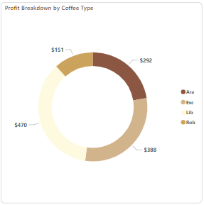

# Coffee Beans Sales Analysis

## Table of Contents

- [Executive Summary](#executive-summary)
- [Project Overview](#project-overview)
- [Data set](#data-set)
- [Data Cleaning and Preparation](#data-cleaning-and-preparation)
- [Objective Questions](#objective-questions)
- [Code](#code)
- [Findings](#findings)
- [Recommendations](#recommendations)
- [Limitations](#limitations)

### Executive Summary
This project examined sales data for different varieties of coffee in several regions, with an emphasis on revenue, profit patterns, consumer preferences, and sales performance over an extended period of time. Important information on product profitability, regional preferences, and consumer behavior was gleaned from the analysis. The United States is notably the leader in total revenue, with Arabica coffee being the most popular and Excelsa coffee earning the most revenue altogether. In 2022, there were notable drops in earnings and revenue, necessitating strategic adjustments.
Keyrecommendations include;

- Targeted Marketing:
Promote light brown roasts in the United States, medium brown roasts in the United Kingdom, and dark brown roasts in Ireland.

- Product Planning:
Improve product offers by creating promotions and blends that are profitable and in line with local preferences.

- Client Allegiance:
The loyalty program has to be reviewed because non-cardholders now make larger purchases than cardholders.

- Analyzing Costs:
Re-evaluate the pricing and costs ofproducts to increase profit.
Future analysis should include cost data to give a more precise picture of profitability.

- Stock Management:
Ensure consistent stock availability for high revenue products to prevent stockouts and meet customer demand, driving continued revenue growth and customer satisfaction.

### Project Overview
This project aims to analyze coffee sales data to unwrap insights into revenue, profit, quantity and customer preferences across different regions and coffee types. By scrutinizing trends and patterns, the project seeks to provide actionable recommendations for optimizing sales strategies and improving overall business performance.

### Data Set
#### Orders Sheet:
- Order ID: A unique identifier for each order made.
- Order Date: The date when the order was placed.
- Customer ID: An identifier linking the order to a specific customer.
- Product ID: A unique identifier for each coffee product.
- Quantity: Quantity of the coffee product ordered.

#### Customer Sheet:
- Customer ID: A unique identifier for each customer.
- Customer Name: Name of the customer.
- Email Address: Contact information for customers.
- Phone Number: Contact information for customers.

#### Products Sheet:

- Product ID: A unique identifier for each coffee product.
- Coffee Type: The type or blend of coffee. Such as Arabica - Ara, Robusta - Rob, Liberica - Lib or Excelsa - Exc.
- Roast Type: The roast level. Light - L, Medium - M, or Dark - D roast.
- Size: Information about the product size.
- Unit Price: The price of a single unit of the coffee product.
- Price Per 100g: The price per 100 grams of the product.
- Profit: Profitability of each coffee product.


### Tools Used
- SQL: Data cleaning and Data analysis
- Power BI: DAX and Visualization

### Data Cleaning and Preparation
1. Data Loading - Created a database and also created three tables. Loaded data into the tables.
2. Duplicate check - Checked for duplicates and confirmed there are no duplicate records.
3. Checked and handled missing values.
4. Dropped useless columns.
5. Data type conversion - Updated date format to ensure proper analysis.
6. Feature engineering - Joined various tables and created another table as a view. The sales_summary.

### Dashboards 


 

 

### Objective Questions
#### Revenue
- What is the total revenue?
- What is the distribution of revenue by coffee type?
- In Which countries are the revenues highest and lowest?
- What is the trend of revenue along the years?
- What are the best ten products by revenue?
- What are the worst ten products by revenue?

#### Profit
- What is the total profit?
- Express the profit as a percentage of Total Revenue.
- What is the distribution of profit by coffee type?
- What is the distribution of profit by years?

#### Quantity
- Daily quantity trend.

#### Customer preferences
- What coffee types are most and least preferred countrywise?
- What coffee type is generally preferred?
- What roast type is mostly preferred countrywise?

#### Loyalty program
- How many customers have loyalty cards?
- What is the distribution of quantity by loyaltycards?

### Code
Find the rest of the code, check the [SQL_queries.sql](https://github.com/IvanRimba/coffee-beans-analysis/blob/main/SQL_queries.sql) file.
```SQL
CREATE DATABASE coffeebeans;

CREATE TABLE coffeecustomers;
CREATE TABLE coffeeprods;
CREATE TABLE orders;

-- --Data cleaning
-- --DROPPING USELESS COLUMNS

ALTER TABLE orders
DROP Customer_Name,
DROP Email,
DROP Country,
DROP Coffeetype,
DROP Roasttype,
DROP Size,
DROP Unitprice,
DROP Sales;

-- --CHECKING FOR DUPLICATES
WITH duplicates as(
SELECT *,
ROW_NUMBER() OVER(PARTITION BY OrderID, OrderDate, CustomerID, ProductID, Quantity) AS row_num
FROM orders
)
SELECT * 
FROM duplicates
WHERE row_num > 1;
```
### Findings
- The total revenue for the four years was $45.13K.
- Excelsa coffee yielded the highest revenue at $12,306 closely followed by Liberica at $12,054. Arabica and Robusta yielded $11,768 and $9,005 respectively.

   
- USA had the highest revenue at $35,639 while UK had the lowest revenue at $2,799.

  
- Top ten performing products by revenue.

  
- Bottom ten performing products by revenue.

  
- Revenue trend along the years.
  
  

- Daily quantity trend.

  
- Total profit stood at $4.52K which is 10% of the total revenue.
- Liberica coffee yielded the largest profit at $1,576 while Robusta yielded the lowest proit at $540. Excelsa and Arabica yielded $1,353 and $1,059 respectively.

  

- In 2019 the business established a base profit of $1,230. In 2020 there was a slight drop to $1,193 likely to have been caused by the Covid19 pandemic. In 2021 the profit increased 
    by 15.8% reaching $1,382 followed by a drastic drop to $708 in 2022.

  
- In USA, Arabica is the most preferred coffee type and Liberica the least preffered. In UK, customers mostly prefer Robusta and they least prefer Arabica. In ireland, Arabica is the most preferred coffee type while Excelsa is the least preferred.

  
- Arabica is the most ordered type of coffee.
  
  
- The most preferred roast type in USA is light brown. In Ireland, customers mostly prefer the bolder, robust flavours of dark brown roasts. In UK, customers prefer the balanced flavor found in medium brown roasts.
 
  
  
 - The number of customers with loyalty cards is 440 while that of those who do not have is 470.
 
 - Non cardholders purchased more in quantity at 1,886 units than cardholders who purchased 1,665 units.  

   

  
 ### Recommendations
- Increase market efforts to take advantage on the high revenue potential of Excelsa coffee.
- Find out why Robusta lags behind in sales. Do promotions and discounts to increase its revenue.
- Review the costs of Liberica so as to maintain and most preferably increase its large profitability.
- Re-evaluate the pricing and costs of Robusta to increase its profit.
- Ensure ample stock of Arabica to meet its high demand.
- Run promotions centered around arabica.
- Gather customer feedback to further enhance arabica offerings based on local offerings.
- Emphasize and promote the most preferred roasts across countries in marketing campaigns. Also, carry out customer engagement to use feedbacks and reviews to improve roast offerings to 
  ensure they meet customer preferences in each country.
- Maintaining consistent availability of the top-performing products to avoid missed sales opportunities due to stockouts. This enhances customer experience by meeting demand 
  consistently.
- Conduct a thorough analysis to understand the reason behind the performace of the bottom ten products by revenue. 
- Embrace the succesful strategies from 2021 to stabilize and increase profits.
- Revamp the loyalty program. Offer more attractive and relevant rewards to attract membership.
- Make the loyalty card registration process simple.


### Limitations
- The dataset does not provide the costs details causing profit calculation errors and inability to analyze cost efficiency.
- The data lacks detailed customer demographics which limits further segmentation analysis.
- The data upto July 2022 limits proper analysis.


